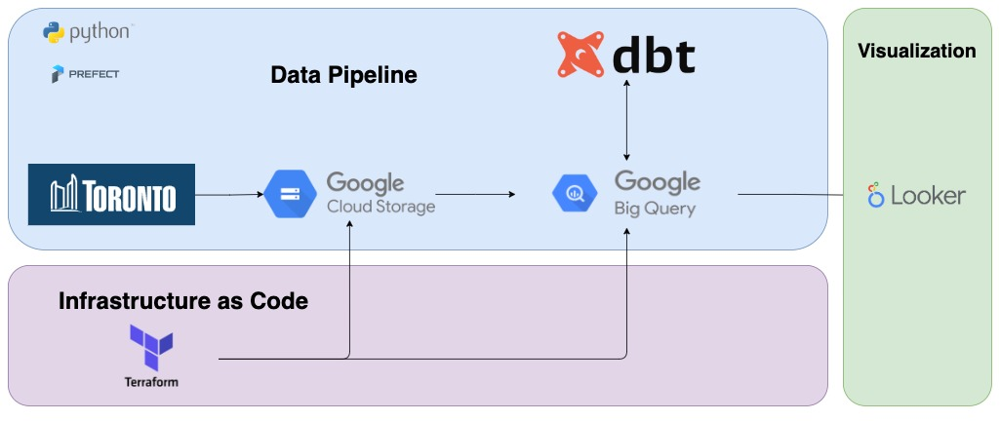

Table of Contents
=================
- [Table of Contents](#table-of-contents)
  - [Project Overview](#project-overview)
  - [Tech Stack](#tech-stack)
  - [Data Pipeline](#data-pipeline)
  - [Running locally](#running-locally)
  - [Further Improvements](#further-improvements)

## Project Overview

This repository is the final project for [Data Engineering Zoomcamp](https://github.com/DataTalksClub/data-engineering-zoomcamp) hosted by our good friends [DataTalks Club](https://www.linkedin.com/company/datatalks-club/). In this project, I selected the COVID-19 Cases in Toronto Data from [Toronto Open Data Catalogue](https://open.toronto.ca/dataset/covid-19-cases-in-toronto/). The criteria for my selection of dataset is that it refreshed in a specific period or at least on a schedule. In this case, the dataset refreshes weekly. I am also interested in the COVID-19 cases in Toronto because some of my friends and family members live there.

The final output is a dashboard that shows some summary statistics of the COVID-19 cases in Toronto. The dashboard is deployed on [Looker Studio](https://lookerstudio.google.com/u/0/navigation/reporting). You can access the dashboard [here](https://lookerstudio.google.com/reporting/cfb414d7-bd2e-4840-9c43-12ba59e9b71b)

## Tech Stack
This project utilizes the following tech stack:
* Python script and Prefect for data pipeline and orchestration
* Google Cloud Platform
  * Google Cloud Storage was used to store the raw data
  * Google BigQuery was used to store the transformed data
  * Google Looker Studio was used to create the dashboard
* Terraform for infrastructure as code
* dbt for more data transformation

## Data Pipeline

The data pipeline consists of the following steps:
1. Use Terraform to create a Google Cloud Storage bucket and a Google BigQuery dataset
2. Extract the data from the Toronto Open Data Catalogue using their API
3. Perform preliminary data transformation using Python script
4. Store the raw data in Google Cloud Storage
5. From the raw data, create a new table in Google BigQuery
6. Perform more data transformation using dbt
7. Create a dashboard using Google Looker Studio

## Running locally
Note: These set of steps assume that the user already created necessary Google Cloud Platform steps such as creating Prefect blocks and storing the credentials in a JSON file. The user should also have Terraform installed on their machine.
1. Clone this repository
```bash
git clone git@github.com:jplaulau14/covid-19-toronto.git
```
2. Create a virtual environment
```bash
python3 -m venv venv
```
3. Activate the virtual environment
For Mac/Linux
```bash
source venv/bin/activate
```
For Windows
```bash
venv\Scripts\activate
```
4. Install the requirements
```bash
pip install -r requirements.txt
```
5. Run the Bash Script for Terraform
```bash
chmod +x scripts/terraform.sh
./scripts/terraform.sh
```
6. Run the Python Script
```bash
python flows/main.py
```

## Further Improvements
* Create a CI/CD pipeline to automate the deployment of the data pipeline
* Use Prefect Cloud to schedule weekly processing
* Add a detailed instruction on running this project locally